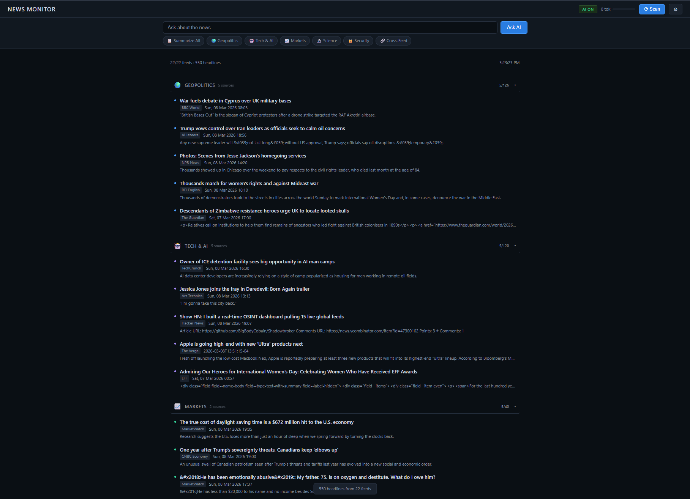
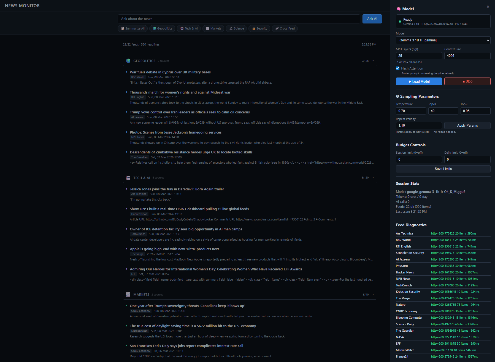

# News Monitor

Layered news dashboard with **embedded local AI**. Pure Rust, zero dependencies.

## Quick Start

The first .gguf model found in `models/` is auto-loaded at startup.
You can switch models live from the settings panel.

```bash
# 1. Build
cargo build --release

# 2. Configure Feeds
cat config.toml

# 3. Put a .gguf model in models/
mkdir models
cp ~/your-model.gguf models/

# 4. Ensure llama-server is on PATH (or place all of llama.cpp under models/)
#    Get it from: https://github.com/ggml-org/llama.cpp/releases

# 5. Run
./target/release/world-monitor
# Open http://127.0.0.1:8080
```



